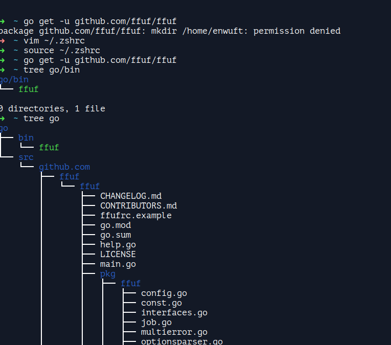

อาจจะเจอในกรณีเดียวกัน จงให้เเน่ใจว่า ได้ set go user path ถูก (ผมคอนฟิค path evironment variable ไม่ถูก)

```bash
export GOPATH="/home/enwuf/go"
export PATH="$GOPATH/bin:$PATH"
```

ถ้า path user ไม่ถูก เมื่อใช้ go get -u SOURCE go เเจ้งว่า permission denied เเต่เราจะสามารถ get ได้โดยผ่าน sudo เเต่นั่นไม่ดีเท่าใหร่(ผมคิดว่างั้น) เพราะ go จะเก็บไฟล์ไว้กับ root user


