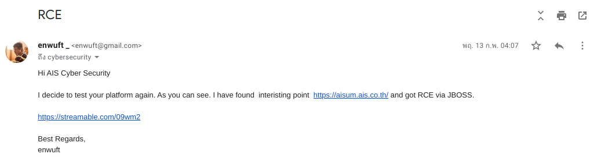
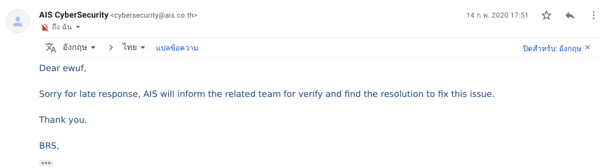

ต้องบอกก่อนเลยว่า เจอช่องโหว่นี้นานเเล้ว ประมาณเดือนกุมภาพันธ์ที่ผ่านมา

#### ช่องโหว่ Jboss

ช่องโหว่ Java Deserialization ใน Apache Common Collections ซึ่งซอฟต์แวร์ชั้นนำจำนวนมากนิยมใช้ ซึ่งรวมถึง WebSphere และ JBoss นั้น วันนี้นักวิจัยทางด้านความปลอดภัยสำหรับนักพัฒนาโดยเฉพาะจาก SourceClear ได้ออกมาเปิดเผยอีกว่า ค้นพบ Library ที่ได้รับผลกระทบเดียวกันนี้อีกกว่า 40 Library เลยทีเดียว

เว็บ aisum.ais.co.th ผมคาดว่า น่าจะไม่ได้ใช้งานนานเเล้ว เเต่ยังไม่ได้ออฟไลน์ไป เเละมีช่องโหว่ซึ่งเเน่นอนสำคัญมาก เพราะทำให้ผู้โจมตีสามารถยึดเครื่องเซิฟเวอร์ นั่นหมายความว่าผู้โจมตีจะทำอะไรกับเครื่องเซิฟเวอร์ก็ได้ ซึ่งเราจะเรียกว่า RCE (Remote code execution)

เครื่องมือช่วย [jexboss]

<iframe src="https://streamable.com/e/ovus47" frameborder="0" width="100%" height="100%" allowfullscreen style="width:100%;height:100%;position:absolute;left:0px;top:0px;overflow:hidden;"></iframe>

#### รายงาน

รายงานช่องโหว่ไปที่ AIS cyber security team. โดยตรงเลยครับ ก่อนหน้านั้นผมทำตัวไม่ดีกับคนไทยที่ผมจะรายงานไปที่เขา ในช่วงเเรกที่เริ่มรายงานช่องโหว่ รู้สึกผิดอยู่เหมือนกัน

เเละทีมก็ตอบกลับมาครับ รู้สึกดีครับ เพราะเขาขอบคุณเรา

ผมไม่สามารถอธิบายถึงรายละเอียดของช่องโหว่ได้ นั่นหมายความว่ายังไม่เข้าใจเท่าไหร่ บายครับ ><

[jexboss]: https://github.com/joaomatosf/jexboss
