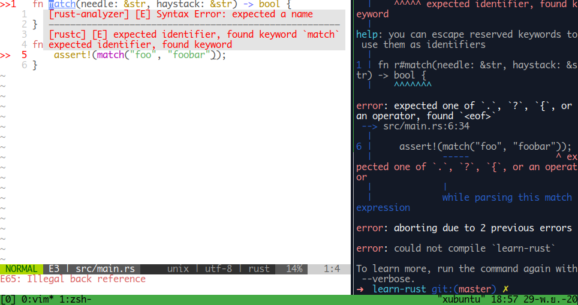
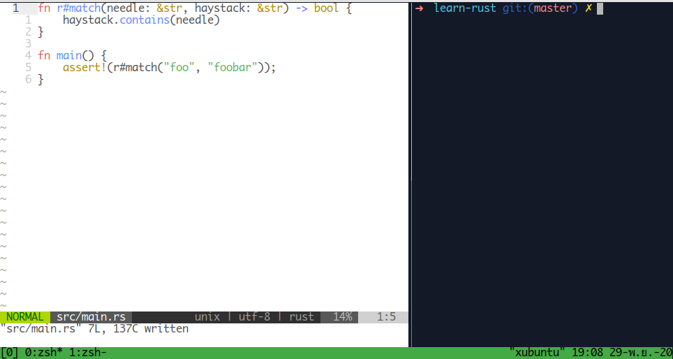

การระบบชื่อของ functions, variables, parameters, struct fields, modules, crates, constants, macros, static values, attributes, types, traits, or lifetimes. ใน rust บาง keywords จะไม่สามารถใช้ในการเขียนได้ จะเรียกว่าคำสงวน

ดังภาพ ระบุชื่อฟังก์ชัน `match` rust-analyzer เเจ้งว่า fn match error ไม่สามารถใช้ระบุเป็นชื่อฟังก์ชันได้ 

วิธีที่เราจะสามารถใช้ keyword ระบุเป็นชื่อฟังก์ชันได้ โดยการระบุ `r#` รวมทั้ง `br#` ตามด้วยคำสงวน เช่น `r#match`, `br#match` เพราะอาจจะมี library ที่ใช้คำสงวนเขียนเป็นชื่อฟังก์ชันจาก rust 2015 edition ใน reddit มีผู้ใช้คนหนึ่งเเสดงความคิดเห็นว่า ถ้าคุณอยากได้ match (keywords) เป็นชื่อฟังก์ชันในโค้ดของคุณ r_match ชื่อฟังก์ชันเเทนก้ไม่ได้เเย่นักหรอก

อ่านเเล้วงงไหมล่ะ ผมก้งง

ผิดพลาดประการอันใด ก็ขออภัยด้วยครับ