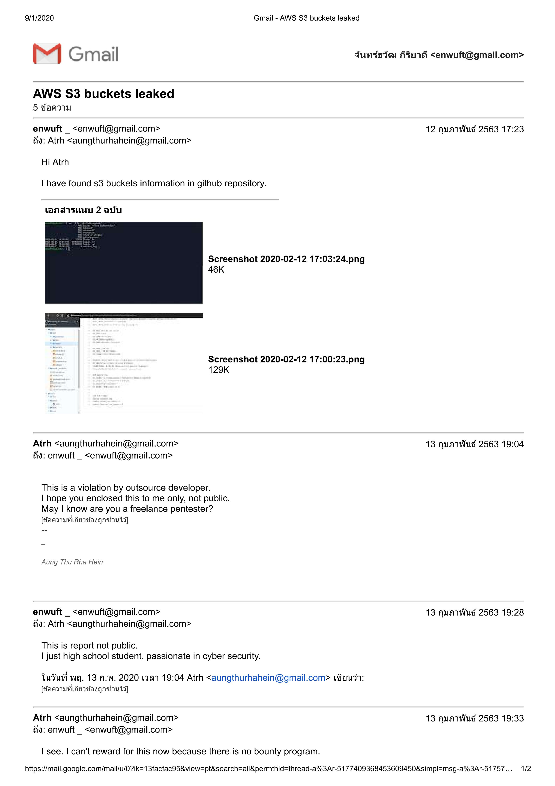

3 ปี ในโพสต์นี้ขอรับความในใจและทัศนคติส่วนตัวที่มีต่อวัฒนธรรม ย้อนไปเมื่อผมเองเรียนมัธยมปีที่ 4 ที่โรงเรียนรัตนบุรี ผมเริ่มมีความสนใจเกี่ยวกับความปลอดภัยของเว็บไซต์ หรือเรียกอีกอย่างหนึ่งว่าการเฮ็ก แล้วตอนนั้น ผมรู้สึกว่ามัน ดูเท่ ดูเจ๋ง โดยที่ผมเองก็ไม่สนใจว่าจะต้องทำความเข้าใจกับรายละเอียดของช่องโหว่ของโปรแกรมหรือระบบปฏิบัติการรวมทั้งเว็บไซต์ ส่วนใหญ่ผมใช้โปรแกรมอัตโนมัติที่มีอยู่เต็มไปหมดในอินเทอร์เน็ต ในวงการการแฮกเขาเรียกกันว่า Script kiddie โดยคนเหล่านี้จะใช้โปรแกรมหรือสคริปต์ที่มีอยู่ในอินเทอร์เน็ตมาใช้ในการแฮกระบบคอมพิวเตอร์และก็ประกาศตนเองว่า ข้าคือ Hacker และ ตลอด 3 ปีผมเองก็ไม่เข้าใจรายละเอียดของช่องโหว่เลย เช่น RCE, LFI, SQL injection ว่าคืออะไร

5 เดือน ผมเจอ community bug bounty คือโปรแกรมที่จะเปิดให้บริษัทเทคโนโลยีที่มีความต้องการทดสอบความปลอดภัยของบริการของตนเองเช่นเว็บไซต์หรือโปรแกรมคอมพิวเตอร์ โดยที่จะเปิดให้แฮกเกอร์ที่มีอยู่ทั่วโลกสามารถเข้ามาทดสอบความปลอดภัยของบริการต่างๆของตนเองได้อย่างถูกกฎหมาย และเมื่อเจอช่องโหว่ จะมีช่องทางแฮกเกอร์รายงาน และบอกรายละเอียดช่องโหว่ให้กับ Vonder และบริษัทจะขอบคุณแฮกเกอร์ที่จะช่องโหว่และรายงานวันที่เขาเป็นเงินรางวัลหรือ เช่น 2000 US 500 US 5000 หรือมากถึง xxx 000 US สิ่งเหล่านี้ทำให้ผมเปลี่ยนทัศนคติของตนเองที่มีต่อการแฮกตลอดระยะเวลา 3 ปีที่ผ่านมา ว่าต้องทำยังไงเพื่อที่จะให้ตนเองมีความเข้าใจในส่วนนี้มากขึ้น และ 5 เดือน ผมต้องขอบอกว่า ผมได้แค่ 750 US ซึ่งดูเหมือนจะไม่ค่อยเยอะ แต่มันทำให้ผมรู้สึกดีกับตัวเอง แล้วยังถูกเเนะนำไปร่วมทำงานที่ Dtac Cyber Security, Toyota Cyber Security of Asia regions.

สิ่งสำคัญคือผมลดอัตตาของตนเองลงอย่างมากและยอมรับว่าการแฮกมันเรียนรู้ได้ตลอดชีวิตจริงๆเหมือนศาสตร์อื่นๆ ที่มีจุดสูงสุดของศาสตร์นั้นมีอยู่ เราต้องใช้เวลาแล้วก็ความพยายามมาก เพื่อที่จะนำตนเองไปถึงจุดนั้น ไม่ใช่เพื่อว่าตนเอง เหนือกว่าคนอื่นหรือคนอื่นด้อยกว่าตนเอง มันแค่ยกระดับความคิดของตนเองเท่านั้น มันคือความรู้ ไม่ใช่การกระทำที่ไม่ต้องประสงค์ของสังคม

Ref: 

